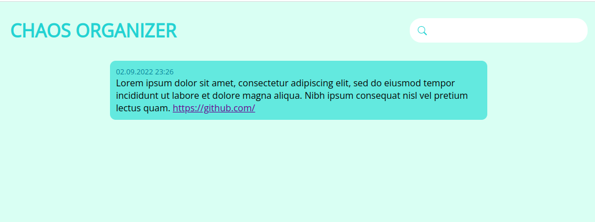
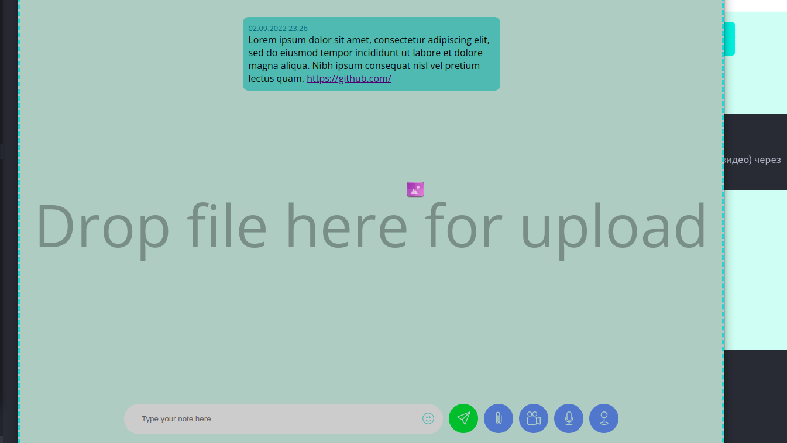
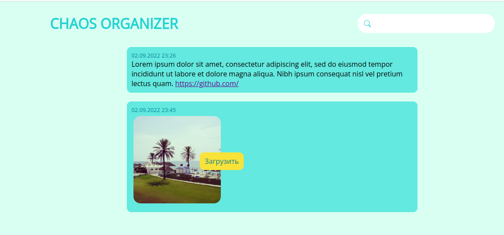
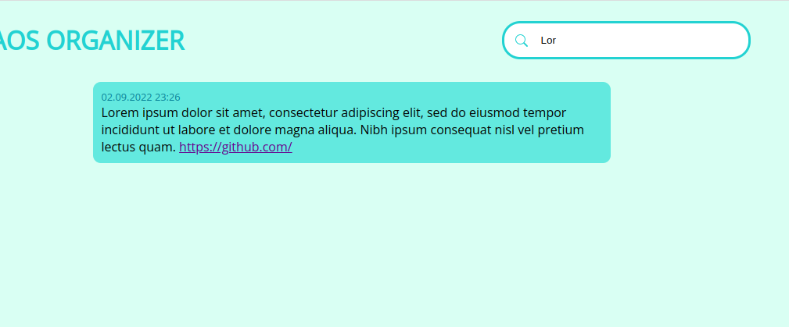
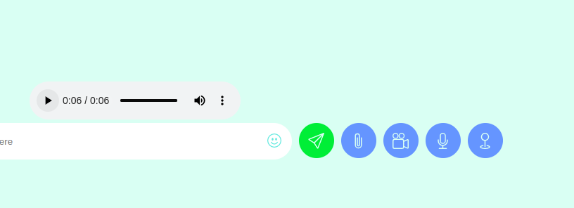
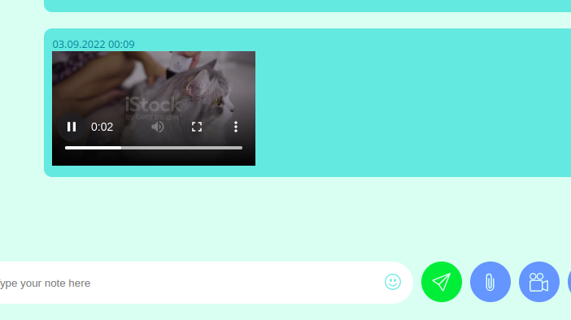
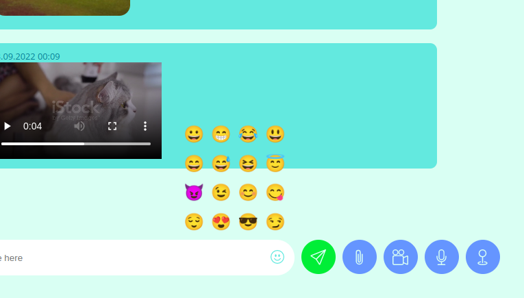
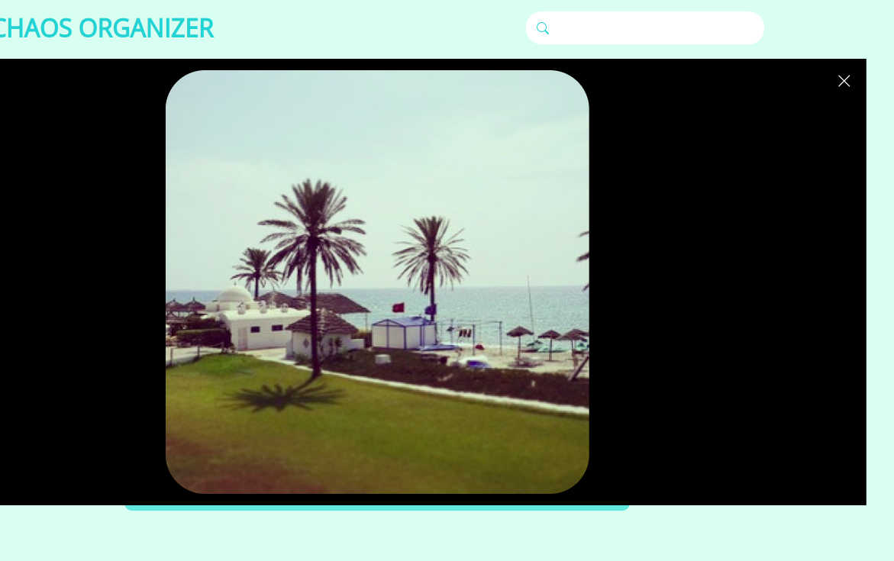

# Chaos Organizer

Привет! Представляю вам пиложение по сбору и хранению информации, реализованное в виде неперывной ленты сообщений в которую можно сохранить текст, фото, видео и аудио. Открыть web-страницу можно [здесь](https://votchitsev.github.io/ChaosOrganizer/).

Сервер для проекта [здесь](https://github.com/Votchitsev/ChaosOrganizer-server).

## Сохранение в истории ссылок и текстовых сообщений

Приложение может сохранять текстовые сообщения и ссылки в них. При этом ссылки остаются кликабельными.

## Загрузка файлов

В ленту можно загрузить файлы (изображения, музыку, видео) через окно выбора файлов или путем перетаскавания (drag and drop). 

## Скачивание файлов на компьютер пользователя

Выгруженные в ленту файлы возможно загрузить на компьютер пользователя. Для загруки изображения необходимо кликнуть по нему правой кнопкой мышки и нажать "загрузить".

## Ленивая подгрузка

При загрузке приложение с первым запросом к серверу загружает первые 10 сообщений. Далее по мере пролистывания ленты сообщения подгружаются по 10 штук.

## Поиск по сообщениям

В приложении реализован динамический поиск сообщений. Запросы к серверу делаются по мере ввода текста. В результате можно найти нужное сообщение введя только часть слова или даже одну букву.

## Запись видео и аудио (используя API браузера)

Нажимая на иконки микрофона или камеры в меню ввода сообщений можно записать видео и звук используя встроенные в компьютер пользователя микрофон и камеру. 

## Отправка геолокации

В меню ввода сообщений есть кнопка для получения геолокации. После нажатия на неё через API браузера определяются текущие координаты пользователя и формируется ссылка на google maps которая вставляется в поле ввода сообщения.

## Воспроизведение видео/аудио (используя API браузера)

Имеется возможность воспроизведения аудио и видео из сообщений.

## Поддержка смайликов (emoji)

Нажав на кнопку в поле ввода текста можно выбрать и вставить в текст смайлик.

## Подробный просмотр фотографии

Нажав на фото в сообщении открывается окно с увеличенным изображением.

